# 证书格式说明


https://blog.51cto.com/wushank/1915795


证书主要的文件类型和协议有: PEM、DER、PFX、JKS、KDB、CER、KEY、CSR、CRT、CRL 、OCSP、SCEP等。


## 一、编码格式


X.509 - 这是一种证书标准,主要定义了证书中应该包含哪些内容.其详情可以参考RFC5280,SSL使用的就是这种证书标准.


目前有以下两种编码格式。

1、**PEM** - Privacy Enhanced Mail,打开看文本格式,以"-----BEGIN..."开头, "-----END..."结尾,内容是BASE64编码.
查看PEM格式证书的信息: openssl x509 -in certificate.pem -text -noout
Apache和NGINX服务器偏向于使用这种编码格式.

     PEM – Openssl使用 PEM(Privacy Enhanced Mail)格式来存放各种信息,它是 openssl 默认采用的信息存放方式。Openssl 中的 PEM 文件一般包含如下信息:

内容类型:表明本文件存放的是什么信息内容,它的形式为“——-BEGIN XXXX ——”,与结尾的“——END XXXX——”对应。

头信息:表明数据是如果被处理后存放,openssl 中用的最多的是加密信息,比如加密算法以及初始化向量 iv。

信息体:为 BASE64 编码的数据。可以包括所有私钥（RSA 和 DSA）、公钥（RSA 和 DSA）和 (x509) 证书。它存储用 Base64 编码的 DER 格式数据，用 ascii 报头包围，因此适合系统之间的文本模式传输。

```
使用PEM格式存储的证书：
—–BEGIN CERTIFICATE—–
MIICJjCCAdCgAwIBAgIBITANBgkqhkiG9w0BAQQFADCBqTELMAkGA1UEBhMCVVMx
………
1p8h5vkHVbMu1frD1UgGnPlOO/K7Ig/KrsU=
—–END CERTIFICATE—–

使用PEM格式存储的私钥：
—–BEGIN RSA PRIVATE KEY—–
MIICJjCCAdCgAwIBAgIBITANBgkqhkiG9w0BAQQFADCBqTELMAkGA1UEBhMCVVMx
………
1p8h5vkHVbMu1frD1UgGnPlOO/K7Ig/KrsU=
—–END RSA PRIVATE KEY—–

使用PEM格式存储的证书请求文件：
—–BEGIN CERTIFICATE REQUEST—–
MIICJjCCAdCgAwIBAgIBITANBgkqhkiG9w0BAQQFADCBqTELMAkGA1UEBhMCVVMx
………
1p8h5vkHVbMu1frD1UgGnPlOO/K7Ig/KrsU=
—–END CERTIFICATE REQUEST—–
-----------------------------------
der pem cer crt key pfx等概念及区别
https://blog.51cto.com/wushank/1915795
```


2、**DER** – 辨别编码规则 (DER) 可包含所有私钥、公钥和证书。它是大多数浏览器的缺省格式，并按 ASN1 DER 格式存储。它是无报头的 － PEM 是用文本报头包围的 DER。

     DER - Distinguished Encoding Rules,打开看是二进制格式,不可读.
查看DER格式证书的信息: x509 -in certificate.der -inform der -text -noout
Java和Windows服务器偏向于使用这种编码格式.

证书编码的转换
**PEM转为DER** openssl x509 -in cert.crt -outform der -out cert.der

**DER转为PEM** openssl x509 -in cert.crt -inform der -outform pem -out cert.pem

(提示:要转换KEY文件也类似,只不过把x509换成rsa,要转CSR的话,把x509换成req...)


## 二、相关的文件扩展名


这是比较误导人的地方,虽然我们已经知道有PEM和DER这两种编码格式，但文件扩展名并不一定就叫"PEM"或者"DER"，常见的扩展名除了PEM和DER还有以下这些，它们除了编码格式可能不同之外，内容也有差别，但大多数都能相互转换编码格式。

**CRT** - CRT应该是certificate的三个字母，其实还是证书的意思，常见于*NIX系统，有可能是PEM编码，也有可能是DER编码，大多数应该是PEM编码,相信你已经知道怎么辨别。

**CER** - 还是certificate，还是证书,常见于Windows系统，同样的，可能是PEM编码，也可能是DER编码，大多数应该是DER编码，证书中没有私钥，DER 编码二进制格式的证书文件。

**KEY** - 通常用来存放一个公钥或者私钥，并非X.509证书，编码同样的，可能是PEM，也可能是DER。
查看KEY的办法：openssl rsa -in mykey.key -text -noout
如果是DER格式的话，同理应该这样了：openssl rsa -in mykey.key -text -noout -inform der

**CSR** - Certificate Signing Request，即证书签名请求，这个并不是证书，而是向权威证书颁发机构获得签名证书的申请，其核心内容是一个公钥(当然还附带了一些别的信息)，在生成这个申请的时候，同时也会生成一个私钥，私钥要自己保管好，做过iOS APP的朋友都应该知道是怎么向苹果申请开发者证书的吧。
查看的办法：openssl req -noout -text -in my.csr (如果是DER格式的话照旧加上-inform der，这里不写了)

**PFX/P12** - predecessor of PKCS#12，包含公钥和私钥的二进制格式证书。

       对nginx服务器来说,一般CRT和KEY是分开存放在不同文件中的,但Windows的IIS则将它们存在一个PFX文件中,(因此这个文件包含了证书及私钥)这样会不会不安全？应该不会,PFX通常会有一个"提取密码",你想把里面的东西读取出来的话,它就要求你提供提取密码,PFX使用的时DER编码,如何把PFX转换为PEM编码？
openssl pkcs12 -in for-iis.pfx -out for-iis.pem -nodes
这个时候会提示你输入提取代码. for-iis.pem就是可读的文本。
生成pfx的命令类似这样：openssl pkcs12 -export -in certificate.crt -inkey privateKey.key -out certificate.pfx

其中CACert.crt是CA（权威证书颁发机构）的根证书，有的话也通过-certfile参数一起带进去，这么看来，PFX其实是个证书密钥库。

**p7b** - 以树状展示证书链(certificate chain)，同时也支持单个证书，不含私钥。

**JKS** - 即Java Key Storage，这是Java的专利，跟OpenSSL关系不大，利用Java的一个叫"keytool"的工具,可以将PFX转为JKS，当然了，keytool也能直接生成JKS，不过在此就不多表了。


备注实例：

1、从pfx导出crt和key:

操作命令：
openssl pkcs12 -in example.cn.ssl.pfx -nocerts -nodes -out example.key
openssl pkcs12 -in example.cn.ssl.pfx -clcerts -nokeys -out example.crt

2、将crt和key合并出pfx:

操作命令：

openssl pkcs12 -export -in certificate.crt -inkey privateKey.key -out certificate.pfx


## 三、实际操作


1、先有pfx证书。

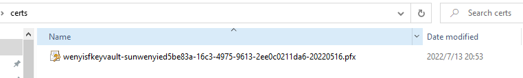


2、用下面命令把 pfx 转换成 pem

```bash
openssl pkcs12 -in wenyisfkeyvault-sunwenyied5be83a-16c3-4975-9613-2ee0c0211da6-20220516.pfx -out wenyis.pem -noenc
```


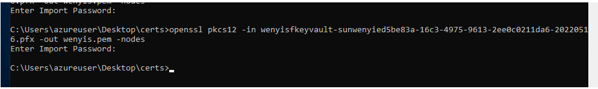


3、查看pem内容

```bash
PS C:\Users\azureuser\Desktop\certs> openssl x509 -in wenyis.pem -text -noout
Certificate:
    Data:
        Version: 3 (0x2)
        Serial Number: 0 (0x0)
        Signature Algorithm: sha256WithRSAEncryption
        Issuer: C = US, ST = Arizona, L = Scottsdale, O = "GoDaddy.com, Inc.", CN = Go Daddy Root Certificate Authority - G2
        Validity
            Not Before: Sep  1 00:00:00 2009 GMT
            Not After : Dec 31 23:59:59 2037 GMT
        Subject: C = US, ST = Arizona, L = Scottsdale, O = "GoDaddy.com, Inc.", CN = Go Daddy Root Certificate Authority - G2
        Subject Public Key Info:
            Public Key Algorithm: rsaEncryption
                Public-Key: (2048 bit)
                Modulus:
                    00:bf:71:62:08:f1:fa:59:34:f7:1b:c9:18:a3:f7:
                    80:49:58:e9:22:83:13:a6:c5:20:43:01:3b:84:f1:
                    e6:85:49:9f:27:ea:f6:84:1b:4e:a0:b4:db:70:98:
                    c7:32:01:b1:05:3e:07:4e:ee:f4:fa:4f:2f:59:30:
                    22:e7:ab:19:56:6b:e2:80:07:fc:f3:16:75:80:39:
                    51:7b:e5:f9:35:b6:74:4e:a9:8d:82:13:e4:b6:3f:
                    a9:03:83:fa:a2:be:8a:15:6a:7f:de:0b:c3:b6:19:
                    14:05:ca:ea:c3:a8:04:94:3b:46:7c:32:0d:f3:00:
                    66:22:c8:8d:69:6d:36:8c:11:18:b7:d3:b2:1c:60:
                    b4:38:fa:02:8c:ce:d3:dd:46:07:de:0a:3e:eb:5d:
                    7c:c8:7c:fb:b0:2b:53:a4:92:62:69:51:25:05:61:
                    1a:44:81:8c:2c:a9:43:96:23:df:ac:3a:81:9a:0e:
                    29:c5:1c:a9:e9:5d:1e:b6:9e:9e:30:0a:39:ce:f1:
                    88:80:fb:4b:5d:cc:32:ec:85:62:43:25:34:02:56:
                    27:01:91:b4:3b:70:2a:3f:6e:b1:e8:9c:88:01:7d:
                    9f:d4:f9:db:53:6d:60:9d:bf:2c:e7:58:ab:b8:5f:
                    46:fc:ce:c4:1b:03:3c:09:eb:49:31:5c:69:46:b3:
                    e0:47
                Exponent: 65537 (0x10001)
        X509v3 extensions:
            X509v3 Basic Constraints: critical
                CA:TRUE
            X509v3 Key Usage: critical
                Certificate Sign, CRL Sign
            X509v3 Subject Key Identifier: 
                3A:9A:85:07:10:67:28:B6:EF:F6:BD:05:41:6E:20:C1:94:DA:0F:DE
    Signature Algorithm: sha256WithRSAEncryption
    Signature Value:
        99:db:5d:79:d5:f9:97:59:67:03:61:f1:7e:3b:06:31:75:2d:
        a1:20:8e:4f:65:87:b4:f7:a6:9c:bc:d8:e9:2f:d0:db:5a:ee:
        cf:74:8c:73:b4:38:42:da:05:7b:f8:02:75:b8:fd:a5:b1:d7:
        ae:f6:d7:de:13:cb:53:10:7e:8a:46:d1:97:fa:b7:2e:2b:11:
        ab:90:b0:27:80:f9:e8:9f:5a:e9:37:9f:ab:e4:df:6c:b3:85:
        17:9d:3d:d9:24:4f:79:91:35:d6:5f:04:eb:80:83:ab:9a:02:
        2d:b5:10:f4:d8:90:c7:04:73:40:ed:72:25:a0:a9:9f:ec:9e:
        ab:68:12:99:57:c6:8f:12:3a:09:a4:bd:44:fd:06:15:37:c1:
        9b:e4:32:a3:ed:38:e8:d8:64:f3:2c:7e:14:fc:02:ea:9f:cd:
        ff:07:68:17:db:22:90:38:2d:7a:8d:d1:54:f1:69:e3:5f:33:
        ca:7a:3d:7b:0a:e3:ca:7f:5f:39:e5:e2:75:ba:c5:76:18:33:
        ce:2c:f0:2f:4c:ad:f7:b1:e7:ce:4f:a8:c4:9b:4a:54:06:c5:
        7f:7d:d5:08:0f:e2:1c:fe:7e:17:b8:ac:5e:f6:d4:16:b2:43:
        09:0c:4d:f6:a7:6b:b4:99:84:65:ca:7a:88:e2:e2:44:be:5c:
        f7:ea:1c:f5
```


4、从pfx生成key

```bash
openssl pkcs12 -in wenyisfkeyvault-sunwenyied5be83a-16c3-4975-9613-2ee0c0211da6-20220516.pfx -nocerts -out wenyis.key
```


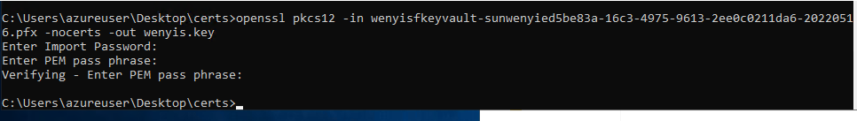

PEM pass phrase: SUNwenyi1234


5、查看key 

```bash
openssl rsa -in wenyis.key -text -noout
```


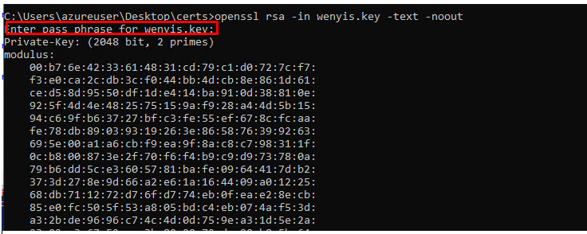


不能用sha256: 

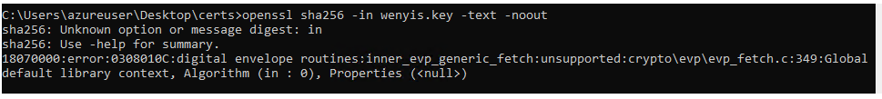


6、创建crt

```bash
openssl pkcs12 -in wenyisfkeyvault-sunwenyied5be83a-16c3-4975-9613-2ee0c0211da6-20220516.pfx -clcerts -nokeys -out wenyis.crt
```


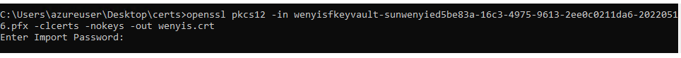


7、CA证书可以在电脑里找到

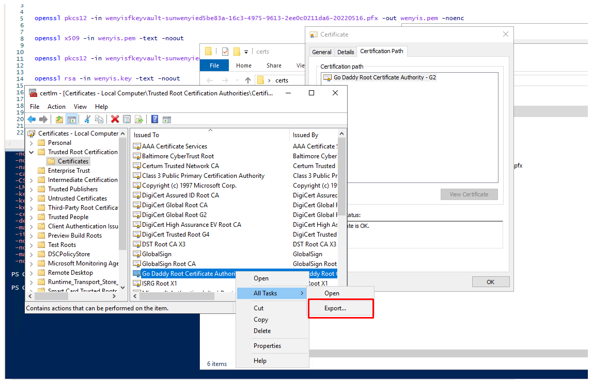


8、把key变成pem

```bash
C:\Users\azureuser\Desktop\certs>openssl rsa -in wenyis.key -text > wenyis_key.pem
Enter pass phrase for wenyis.key:
writing RSA key
```

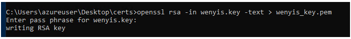


9、把crt变成pem

```bash
C:\Users\azureuser\Desktop\certs>openssl x509 -in wenyis.crt -out wenyis_crt.pem -outform PEM
```

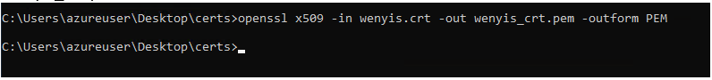


现在我有这些certs：

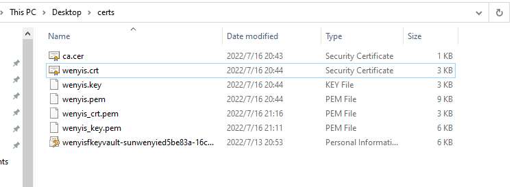


## 四、使用cert


之前在k8s测试过ingress-tls，这里可以使用一下这里生成的证书试试。


（1）生产secret

```bash
kubectl create secret tls wildcard.sunwenyi.com-secret --cert=wenyis.crt --key=wenyis_key.pem -n=ingress-nginx

-------------------------------------
wenyi_sun01@Azure:~/k8sfiles/certs$ kubectl create secret tls wildcard.sunwenyi.com-secret --cert=wenyis.crt --key=wenyis_key.pem -n=ingress-nginx
secret/wildcard.sunwenyi.com-secret created

```


（2）修改ingress-tls。host不允许用*.sunwenyi.com。

```bash
kubectl edit ingress hello-world-ingress-tls -n=ingress-nginx
kubectl edit ingress hello-world-ingress-static-tls -n=ingress-nginx
```


```yaml
apiVersion: networking.k8s.io/v1
kind: Ingress
metadata:
  name: hello-world-ingress-tls
  annotations:
    nginx.ingress.kubernetes.io/rewrite-target: /$2
    nginx.ingress.kubernetes.io/use-regex: "true"
    cert-manager.io/cluster-issuer: letsencrypt
spec:
  ingressClassName: nginx
  tls:
  - hosts:
    - k8s.sunwenyi.com
    secretName: wildcard.sunwenyi.com-secret
  rules:
  - host: k8s.sunwenyi.com
    http:
      paths:
      - path: /hello-world-one(/|$)(.*)
        pathType: Prefix
        backend:
          service:
            name: aks-helloworld-one
            port:
              number: 80
      - path: /hello-world-two(/|$)(.*)
        pathType: Prefix
        backend:
          service:
            name: aks-helloworld-two
            port:
              number: 80
      - path: /(.*)
        pathType: Prefix
        backend:
          service:
            name: aks-helloworld-one
            port:
              number: 80
---
apiVersion: networking.k8s.io/v1
kind: Ingress
metadata:
  name: hello-world-ingress-static-tls
  annotations:
    nginx.ingress.kubernetes.io/ssl-redirect: "false"
    nginx.ingress.kubernetes.io/rewrite-target: /static/$2
spec:
  ingressClassName: nginx
  tls:
  - hosts:
    - k8s.sunwenyi.com
    secretName: wildcard.sunwenyi.com-secret
  rules:
  - host: k8s.sunwenyi.com
    http:
      paths:
      - path: /static(/|$)(.*)
        pathType: Prefix
        backend:
          service:
            name: aks-helloworld-one
            port: 
              number: 80

```


成功：


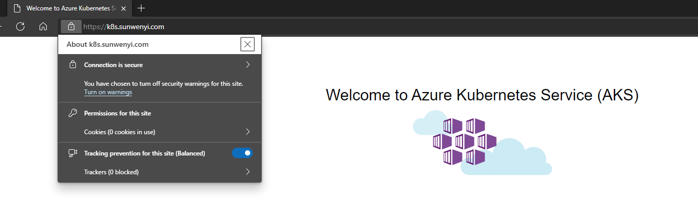


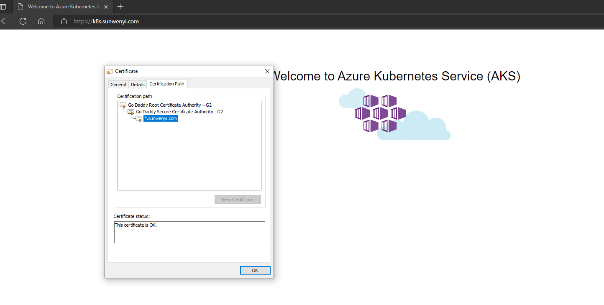


